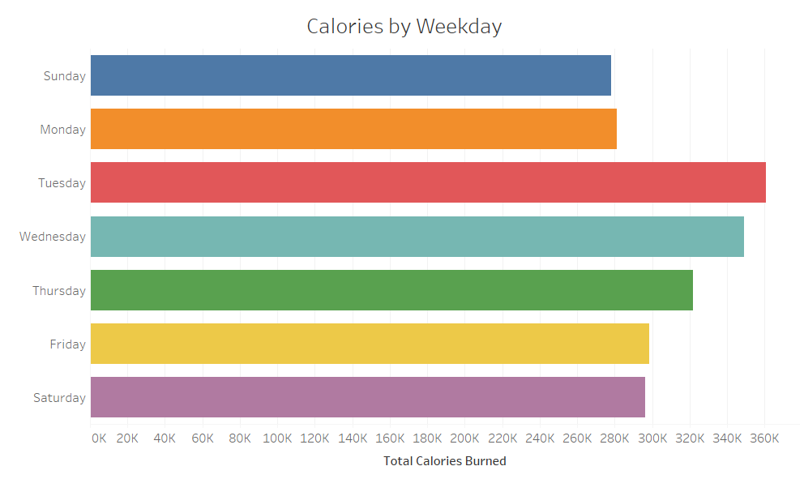

# Case Study: Bellabeat Smart Devices

Data analysis case study concerning health-related smart devices. Implemented for the Google Data Analytics certificate.

## **Ask**: Objectives

For this case study, access to a [FitBit dataset](https://www.kaggle.com/datasets/arashnic/fitbit) is offered with the following overarching goals:

* Observe trends in smart device usage
* Determine applicability to Bellabeat products
* Suggest takeaways for marketing strategy

To work towards these goals with the given data, the task can be described as follows:

> Differentiate potential users of the Leaf or Time devices to identify tailored selling points.

## **Prepare**: Data Description

This project uses crowd-sourced FitBit Fitness Tracker data collected via Amazon Mechanical Turk between 3/12/2016 and 5/12/2016. Includes info concerning activity, calories burnt, sleep, steps, and logged weight for 30 participants.

Unzip *data/Fitabase Data 4.12.16-5.12.16.zip* for the raw data and to replicate cleaning. Unzip *data/cleaned/* to analyze and visualize.

### Acknowledgment

* Source: [Furberg, Robert; Brinton, Julia; Keating, Michael; Ortiz, Alexa @ Zenodo](<https://zenodo.org/record/53894#.YMoUpnVKiP9>)
* Accessed: [Möbius @ Kaggle](<https://www.kaggle.com/datasets/arashnic/fitbit>)

Also references average daily steps from <http://activityinequality.stanford.edu/docs/activity-inequality-althoffetal-nature.pdf>

## **Process**: Cleaning Data

Data manipulation steps included:

* Cleaning
  * Dropping missing data
  * Identifying and dropping duplicated data
  * Column renaming
  * Date/time conversions
  * Rounding to nearest minutes
* Merging tables into following groups
  * Daily
  * Hourly
  * Minute
  * Weight logging
  * User measures
* Feature creation
  * Whether a user wore a device on a given day
  * Compute number of minutes each user wore device
  * Clustering users with KMeans

A more detailed breakdown can be found with the cleaned data in *data/cleaned/steps.md*

## **Analysis**: Findings

Clustering customers reveals distinct groups of users that prefer either high intensity activity vs steady state.

The former benefit from features quantifying time spent in high intensity while the benefit would appreciate the stability associated with high step counts when it comes to calories burnt.

A small sample size and period combined with little use of the sleep and weight logging features limit the ability to draw too many conclusions.

Additionally, a relative lack of related health metrics may limit user interest; data concerning mood, stress, and energy tracking may encourage engagement with this feature and foster further analysis.

## **Share**: Visualization

### Clustering Users

Clustering FitBit users serves to differentiate users and their interests. Testing two popular methods suggests a reasonable number of groups to identify:

We will opt to describe four groups of users with KMeans for balanced clusters. Differentiating factors are as follows:

From the above, we can observe a middling cluster that doesn't wear their band that much, a group that wears their band often with middling intensity and results, a cluster that goes for lower intensity exercise with comparable results, and a group that burns many more calories with high intensity.

These patterns can be used to identify features to highlight for different audiences.

### Group 1: Intense

The benefits of programs like high intensity interval training (HIIT) are widely known. The data illustrates how activity at this level is disproportionately rewarding:

The identified cluster of users that engages in this kind of activity may be particularly interested in the ability to track minutes with identifiably high intensity.

### Group 2: Slow and Steady

Other users would opt for lower intensities. They may appreciate the relative determinism of high step counts:

Programs, features, and marketing encouraging steady state exercise would be better for targeting this crowd.

### Sleep

In this dataset, there is relatively little use of the band while asleep. Combined with the small sample size, usage window, and relavent metrics for comparison, there isn't much to corroborate the many benefits of sleep quality (and therefore tracking).

The following shows the lack of consistent relationship between calories and time asleep.

### Weight Logging

The weight logging function wasn't frequently used within the limited dataset. However, the following does indicate a pattern of engagement with the feature.

## **Act**: Recommendations

Tailor marketing towards two groups.

The first is the high intensity crowd; emphasize the disproportionate benefit of high intensity and the ability of devices to track activity time in the zone.

The second is fond of steady-state activity; focusing on step counts and their relationship with calories burnt will likely prove more successful.

Finally, further exploration may concern sleep tracking as it relates to the other features of the Leaf and Time devices; diving into data with these metrics may reveal how they relate and may be marketed.

---

## More Visualizations

**---**

